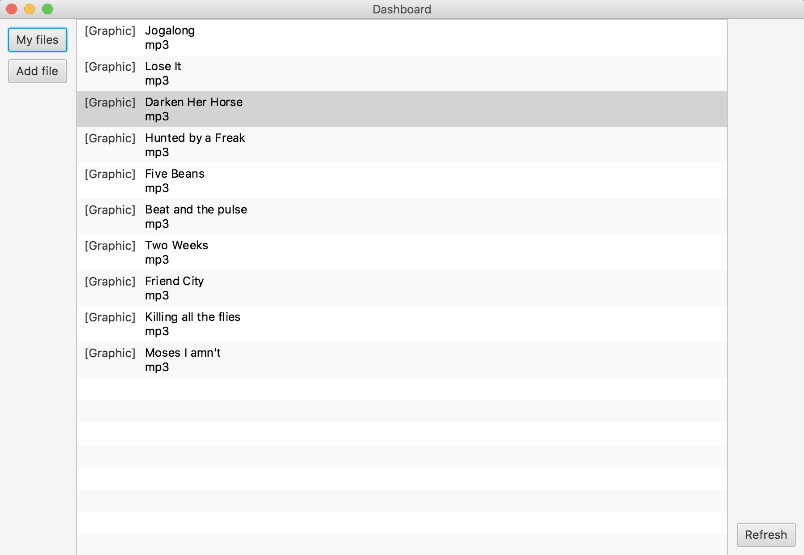
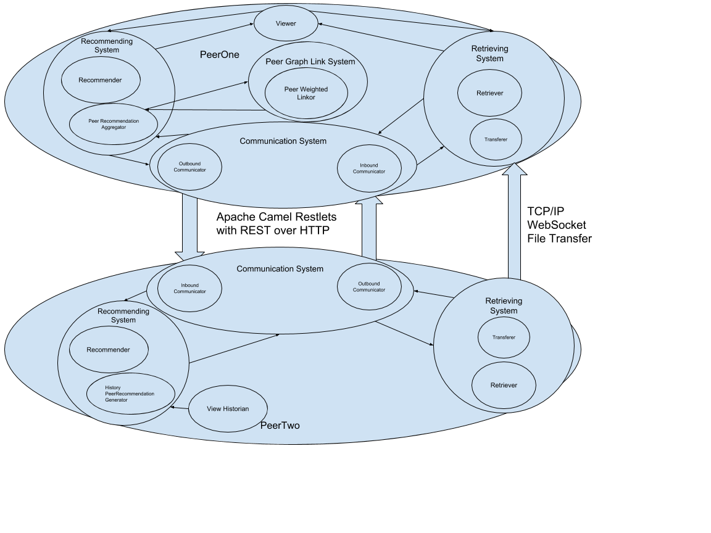

# LAD (Linked and Distributed) Recommender System

Recommender Systems are an increasingly important part of online life. They are now used by many online services to recommend to you products, music, videos, company pages and even people. They are typically centralised in the hands of one company and one set of infrastructure, with each company needing to create its own.

The Linked And Distributed (LAD) Recommender System attempts a full decentralisation and distribution of a recommender system. A graph of similarity between peers, as represented by weighted links, need not be centralised and can be held as an adjacency list on each peer. Each peer only needs to know its own adjacencies with other peers, and the weight of these, and never needs full access to the graph. This is an example of the lack of need for centralisation.

Decentralisation is not only possible but would be far more advantageous in terms of computation and bandwidth if each peer held its own measure of similarity with others, and did its own processing of this similarity. No central processing is required, nor is large amounts of data transfer needed as the data processing is done where the data is.

It is also natural that in a decentralised file sharing network that similarity tracking be embedded directly in the protocol, and indeed for the whole file sharing system to be built around recommendations based on the similarity between peers. The measures of similarity may indeed be more natural if it is directly embedded in real world sharing rather than artificial measures of similarity conducted on a distance centralised server.

Actors are sought to allow simple and scalable handling of concurrency across any arbitrary distributable system. Actors provide a simple method to deploy asynchronous systems that can ignore all the typical complicated concurrency implementations. Actors also are scalable across any type of concurrently operating system, from a simple multithreaded environment, to multiple cores on the same processor, multiple processors in a shared memory machine, multiple nodes in a cluster, or even between any Camel connected IP address across the internet.

Actors allow total scalability for this project, allowing in the future the actors themselves to be distributed not only over multiple cores or processors on a local machine, but to be distributed across a cluster in the cloud or the internet itself, with the GUI and the Viewer actor being all that is required to remain on the peer’s local machine.

Apache Camel provides an ideal way of handling actor message communication across the internet between peers. It handles Restlets and REST over HTTP. Actor messages are typically simple and are similar to the performative speech acts of agents in that they transfer computation rather than data itself. This allows the messages to be converted to simple REST post requests and be sent between two Apache Camel endpoints. The need for frequent simple message passing, and only infrequent large data transfers, make Apache Camel and REST ideal for this project.

**System Architecture**

The overarching concept of the Distributed Recommender System is that each peer is a node in a theoretical graph and keeps its own adjacency list with other nodes in the graph. The graph is therefore fully decentralised and requires no central server to store.

This is feasible because in a recommender system a peer only ever needs to know its similarity to other peers. The weighted links it has in its adjacency list with other peers satisfy the measure of similarity. Therefore there is no need for a peer to know more than the adjacencies for its own node in the graph. The graph can thus be fully distributed and decentralised.

*An Example between two Peers:*

We imagine a Peer To Peer Request between PeerOne, the requester, and PeerTwo, the requestee.

*Viewing System:*

The Viewing System consists of a Viewer actor and a ViewHistorian actor.
The requester will communicate through their GUI with the Viewer actor to request recommendations. The Viewer will ask the Recommender for Recommendations For User.

The View Historian on the requestee side is used to record content views the Viewer has passed to the GUI and that have been watched. This View History is then used to help a requestee provide recommmendations to a requester based on their own view history.

*Recommending System:*

The Recommending System consists of a Recommender actor and two temporary child actors it delegates to.

On the requester side Recommender delegates to a temporary child actor Peer Recommendation Aggregator to aggregate incoming recommendations from requestees. The weighted link between the requester and the particular requestee is used by a weighted probability heuristic to decide whether to include it or not. The higher the weight between peers, the more likely a recommendation from a requestee will enter the recommendations for the requesting user.

On the requestee side the Recommender delegates to a temporary child actor History Recommendation Generator. This generator will generate recommendations from the requestee from the stored View History in the View Historian.

Recommender sends Recommendations back to Viewer after completing its weighted probabilistic aggregation of recommendations from all its adjacent peers.

*Peer Graph Link System:*

The Peer Graph system consists of the PeerWeightedLinkor actor. This actor stores Universal peer IDs and maps them in a distributed hash map to weights.

The main feature of the PeerWeightedLinkor manages its own consistency between peers and ensures the addition of new links or the update of weights for existing links is kept consistent from both frames of reference. It does this by sending out requests to other peers to update their PeerWeightedLinkor too.

The Distributed Hash Map is also implemented with actors and consists of a DistributedHashMappor actor and its DistributedHashMapBucketors. They implement an asynchronous distributed map.

*Retrieving System:*

The Retrieving System consists of a Retriever actor and a Transferer actor. The Retriever is requested by the Viewer to retrieve a particular content file associated with content that was selected by a user in the GUI. The user chooses to retrieve a particular piece of content associated with a displayed recommendation. The requester Retriever asks a requestee to retrieve and transfer the content back to the requester. The first port of call is the peer who recommended the content in the first place. If he has since deleted an actor known as the Similaritor is queried to try and guess from previous content view patterns of peers which other peer may still have it in local storage. These peers are then asked to retrieve it similarly.

Once one peer has found the content file, its Retriever will delegate to a temporary child actor the Transferer. The Transferer will open a web socket server and await a client to connect to stream the file contents to the requester. The transfer info is passed back to the requester so its Retriever may similarly delegate to a Transferer to receive the transfer.

*Communication System:*

The communication system consists of an OutboundCommunicator and an InboundCommunicator. They both use Apache Camel to create and receive REST requests over HTTP. Apache Camel handles the restlets required for this and also the production of REST post requests. PeerToPeerRequest is a special type of ActorMessage that implements a request between two peers. In the OutboundCommunicator actor messages are converted to JSON and sent as REST post requests to a restlet on the requestee end. InboundCommunicator converts the JSON back to actor messages with a variety of JsonProcessors before relaying them back as actor messages to the relevant actor.

*Data Storage System:*

All contents of the ViewHistorian’s View History, the Similaritor’s map of similar peers and the PeerWeightedLinkors weighted links to peers are backed up by the Databaser actor. Content File storage and retrieval is similarly handled by the Databaser actor. It is implemented by a json object oriented database of properties files that contain key-value pairs.

**Demo**

Download demo with deployment instructions [here](https://www.dl.dropboxusercontent.com/s/ato8gbjq3ee2kvz/LADRecommenderSystemDemo.zip?dl=0).
